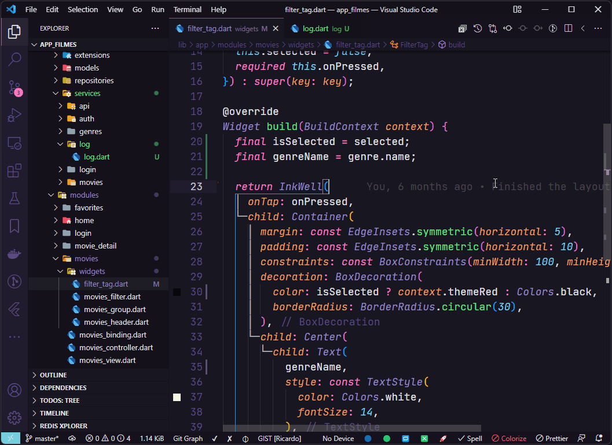
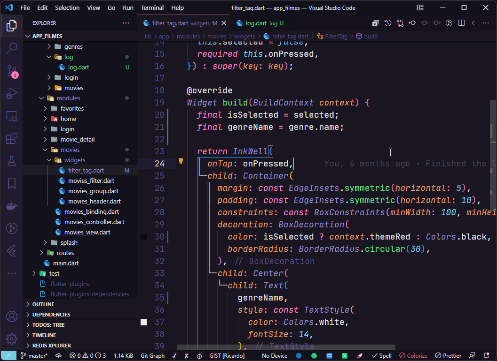
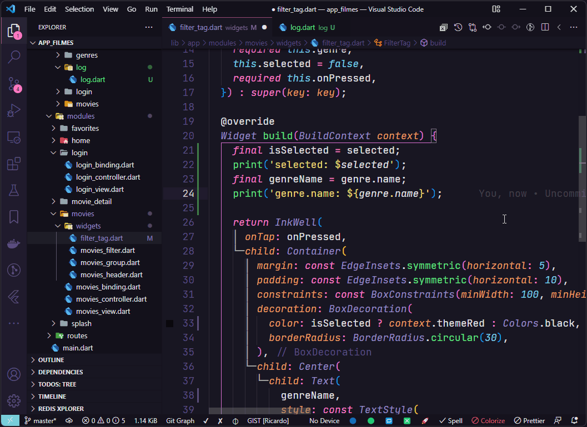
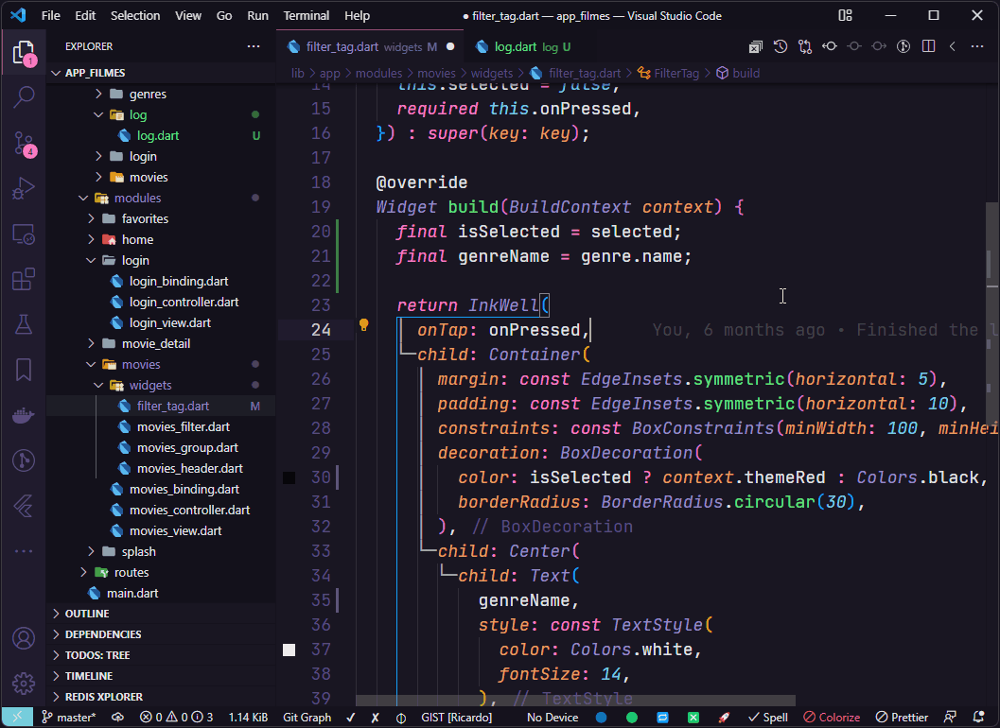
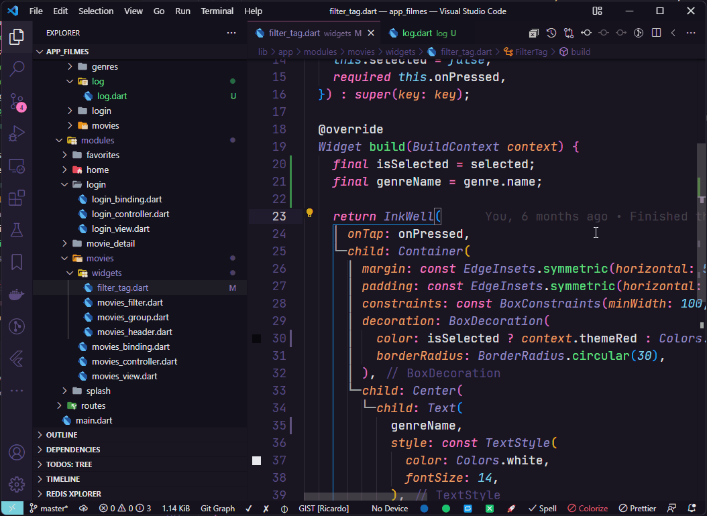

<p align="center">
  <br />
  <a title="Learn more about Flutter Print" href="https://github.com/ricardoemerson/flutter-print">
    
    </a>
</p>

## Support

**Flutter Print** is an extension created for **Visual Studio Code**. If you find it useful, please consider supporting it.

<table align="center" width="100%" border="0">
  <tr>
    <td >
      <a title="PayPal" href="https://www.paypal.com/donate?hosted_button_id=X26H7L6AVMD96">
        
      </a>
    </td>
    <td>
      <a title="Mercado Pago" href="https://mpago.la/1LvP93a">
        
      </a>
    </td>
  </tr>
</table>

## Flutter Print

Easily insert and remove `print('variable: $variable');` statement.

[](https://marketplace.visualstudio.com/items?itemName=ricardo-emerson.flutter-print)
[](https://marketplace.visualstudio.com/items?itemName=ricardo-emerson.flutter-print)
[](https://marketplace.visualstudio.com/items?itemName=ricardo-emerson.flutter-print)
[](https://marketplace.visualstudio.com/items?itemName=ricardo-emerson.flutter-print&ssr=false#review-details)

# Tutorial in Portuguese Brazil.
[![✅ [2022] Como utilizar a extensão Flutter Print para Visual Studio Code?](https://img.youtube.com/vi/Mg_Pg2jQ_p0/0.jpg)](https://www.youtube.com/watch?v=Mg_Pg2jQ_p0)

# Usage Examples

> This extension overrides the shortcut for **Select all occurrences of current selection** - `Ctrl+Shift+L` on Windows and Linux and `Cmd+Shift+L` on macOS, however you can still use `Ctrl+F2` to execute same command.

## Print for variables:

Select the variable that you want uses print statement and press `Ctrl+Shift+L` on Windows, Linux or macOS.




## Print for object properties:

Select the object properties that you want uses print statement and press `Win+Shift+L` on Windows and Linux or `Cmd+Shift+L` on macOS.




## Remove all print statements:

To remove all print statements and press `Win+Shift+D` on Windows and Linux or `Cmd+Shift+D` on macOS.




# With Custom Log Class

Create a custom log class.

```dart
import 'dart:developer' as developer;

class Log {
  Log._();

  static void print(String value) {
    developer.log(value, name: 'LOG');
  }

  static Object? inspect(Object? object) {
    developer.inspect(object);
  }
}
```

## Log.print() for variables:

Select the variable that you want uses a custom Log.print statement and press `Win+Ctrl+L` on Windows and Linux or `Cmd+Ctrl+L` on macOS.




## Log.print() for object properties:

Select the object properties that you want uses a custom Log.print statement and press `Win+Alt+L` on Windows and Linux or `Cmd+Alt+L` on macOS.


## Log.inspect() for variables:

Select the variable that you want uses a custom Log.inspect statement and press `Win+Ctrl+L` on Windows and Linux or `Cmd+Ctrl+L` on macOS.




**That's all, Enjoy!**
